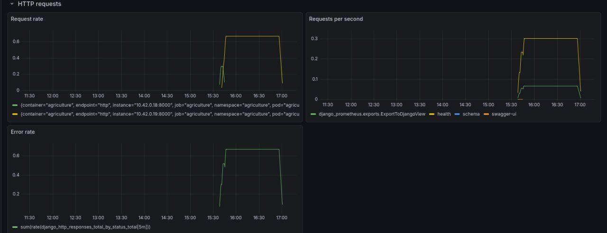
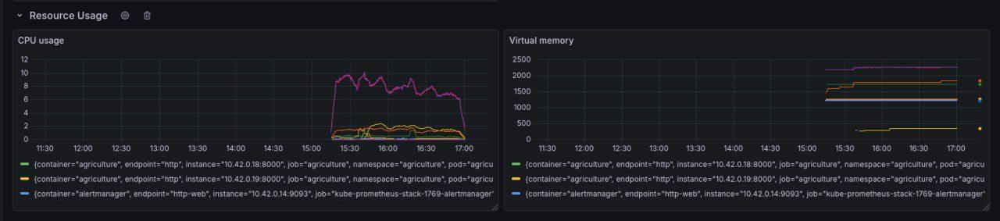
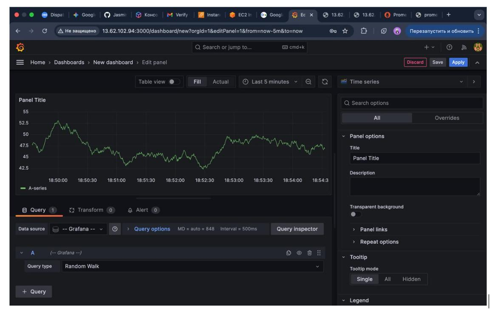
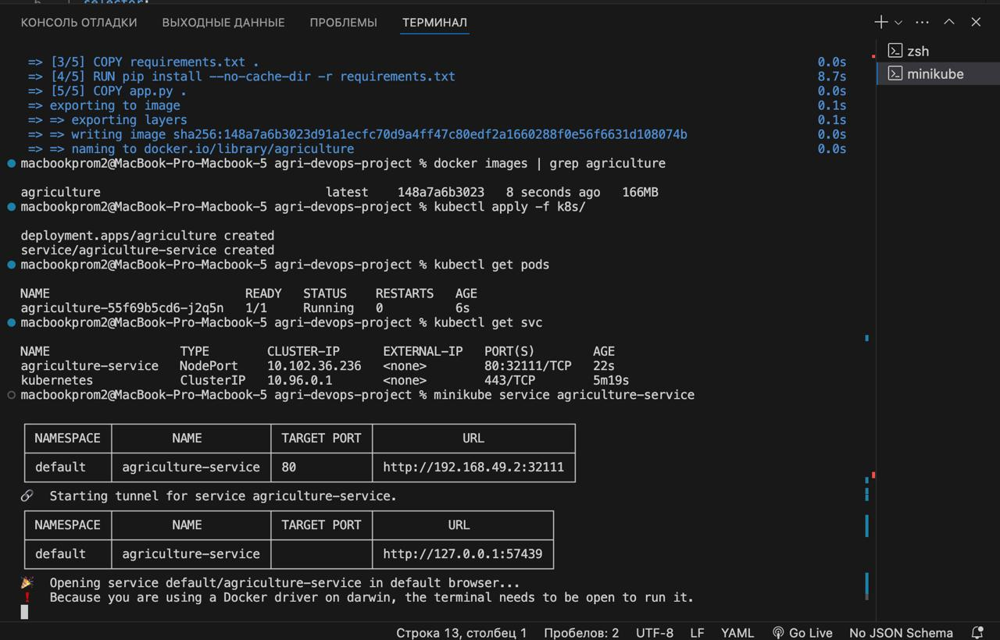
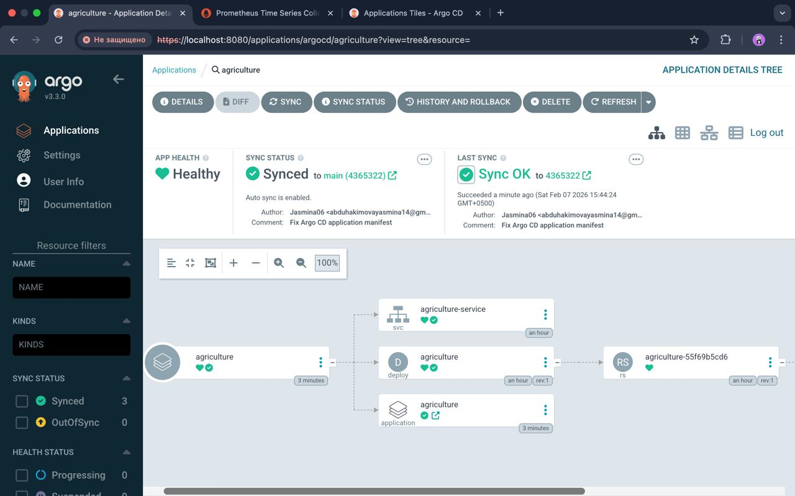

🌱 Agri DevOps Project — GitOps with Argo CD

This repository contains a containerised agricultural web application deployed to Kubernetes and managed using GitOps principles with Argo CD.

The project was developed as an academic DevOps learning project, focusing on containerisation, CI/CD automation, Kubernetes deployment, and GitOps workflows.

📌 Project Overview

The application exposes a simple HTTP API representing an agricultural digital platform.
The main goal of the project is not business logic, but infrastructure, automation, and deployment practices.

Key objectives:

Containerise the application using Docker

Deploy the application to Kubernetes

Manage deployments declaratively using GitOps

Automate synchronization using Argo CD

Integrate monitoring with Prometheus

🧱 Architecture Overview
GitHub Repository
        ↓
     Argo CD
        ↓
   Kubernetes (Minikube)
        ↓
 Deployment → Service → Pod

All Kubernetes resources are stored in GitHub and automatically synced to the cluster by Argo CD.

🛠 Technologies Used

Python (Flask-based API)

Docker & Docker Compose

Kubernetes

Argo CD

GitHub Actions (CI)

Prometheus (metrics collection)

Minikube (local Kubernetes cluster)

📂 Repository Structure

agri-devops-project/
│
├── app.py
├── Dockerfile
├── docker-compose.yml
├── prometheus.yml
├── requirements.txt
│
├── k8s/
│   ├── application.yaml      # Argo CD Application manifest
│   ├── deployment.yaml       # Kubernetes Deployment
│   └── service.yaml          # Kubernetes Service
│
└── .github/workflows/
    └── ci.yml                # CI pipeline

🚀 CI/CD Pipeline

The CI pipeline is implemented using GitHub Actions.

Pipeline steps:

Install dependencies

Run basic checks/tests

Build Docker image

Every push to the main branch triggers the pipeline.

🔁 GitOps with Argo CD

Argo CD is used to manage Kubernetes deployments.

Repository: GitHub

Sync mode: Automatic

Cluster: in-cluster (Minikube)

Namespace: default

Argo CD continuously monitors the Git repository and ensures the Kubernetes cluster matches the declared state.

Argo CD Status

Application Health: ✅ Healthy

Sync Status: ✅ Synced

📊 Monitoring

Prometheus is configured to scrape application metrics exposed by the application.

Metrics endpoint:
`/metrics`

Prometheus configuration is defined in `prometheus.yml`.

### Grafana Dashboard

Grafana is used to visualize metrics collected by Prometheus.
The dashboard provides real-time visibility into application behaviour and system performance.

Below is an example Grafana dashboard displaying live metrics:

⚙️ Running the Project Locally
1️⃣ Start Kubernetes
minikube start --driver=docker

2️⃣ Install Argo CD
kubectl create namespace argocd
kubectl apply -n argocd -f https://raw.githubusercontent.com/argoproj/argo-cd/stable/manifests/install.yaml

3️⃣ Access Argo CD UI
kubectl port-forward svc/argocd-server -n argocd 8080:443

Open:
👉 https://localhost:8080

## ArgoCD Application

🎯 Conclusion

This project demonstrates a complete DevOps workflow:

Containerisation

CI automation

Kubernetes deployment

GitOps-based delivery using Argo CD

Monitoring with Prometheus

The focus of the project is infrastructure, reliability, and automation, rather than application complexity.